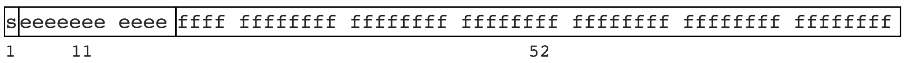

## JS 数字丢失精度的原因
计算机的**二进制实现**和**位数限制**,有些数无法有限表示。就像一些无理数不能有限表示，如 圆周率 3.1415926...，1.3333... 等。JS 遵循 IEEE 754 规范，采用双精度存储（double precision），占用 64 bit。如图



>ps:如果图片没有显示，你可以百度`解决github上的图片显示不出来的问题`,这里不作详解

说明
- 1位用来表示符号位
- 11位用来表示指数
- 52位表示尾数 有效数字

### 浮点数精度问题

```
0.1 >> 0.0001 1001 1001 1001…（1001无限循环）
0.2 >> 0.0011 0011 0011 0011…（0011无限循环）
```

此时只能模仿十进制进行四舍五入了，但是二进制只有 0 和 1 两个，于是变为 0 舍 1 入。这即是计算机中部分浮点数运算时出现误差，丢失精度的根本原因。

### 大数精度问题
大整数的精度丢失和浮点数本质上是一样的，尾数位最大是 52 位，因此 JS 中能精准表示的最大整数是 Math.pow(2, 53)，十进制即 9007199254740992。

```
9007199254740992     >> 10000000000000...000 // 共计 53 个 0
9007199254740992 + 1 >> 10000000000000...001 // 中间 52 个 0
9007199254740992 + 2 >> 10000000000000...010 // 中间 51 个 0
```


实际上

```
9007199254740992 + 1 // 丢失
9007199254740992 + 2 // 未丢失
9007199254740992 + 3 // 丢失
9007199254740992 + 4 // 未丢失
```


### toFixed 四舍五入结果不准确

```
1.335.toFixed(2) == 1.33
```

**[JS实现十进制与二进制的互相转换](binaryToDecimal.md)**
